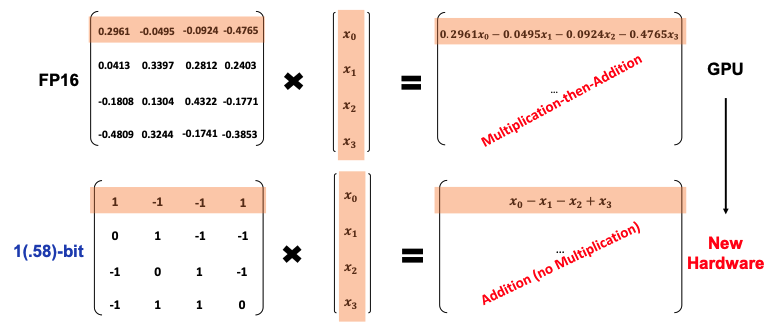
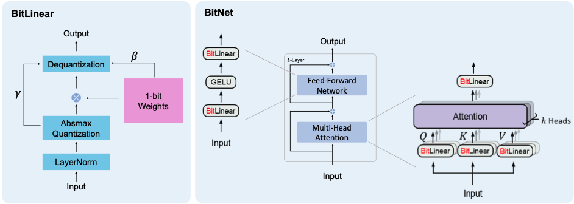

# MLX BitNet

MLX implementation of the 1.58 Bit LLM from the Microsoft Research paper "The Era of 1-bit LLMs:
All Large Language Models are in 1.58 Bits".

[Paper link](https://arxiv.org/pdf/2402.17764.pdf)

*Note: MLX is an array framework for machine learning research on Apple silicon. As a result, this model is optimised for Apple Silicon. [Repo link](https://github.com/ml-explore/mlx)*

## OG 1 Bit BitNet

The [first BitNet paper](https://arxiv.org/pdf/2310.11453.pdf) outlined a model with 1bit weights (1 or 0). The BitNet architecture simply swaps out linear layers with float weights for linear layers with 1bit weights. Model training, however, requires keeping track of 16bit floats and employing **Quantization-Aware Training**. This showed some promising results.

## Taking BitNet to another level: 1.58 Bits

The second paper, and the one this repository is based on, took the original BitNet paper further and introduced ternary weights (-1, 0 or 1), hence 1.58 Bit since:

$$
\log_2(3) \approx 1.58
$$

The results of this paper were astounding, almost feeling too good to be true, with the research team reporting a **Pareto improvement**, i.e. better in every dimension!

## Acknowledgements

- 1bitLLM on huggingface for releasing the model weights that we are using: https://huggingface.co/NousResearch
- [Nous Research](https://huggingface.co/NousResearch) for [training](https://huggingface.co/NousResearch/OLMo-Bitnet-1B) a 1.58 Bit LLM and independently confirming some preliminary results
- Awni Hannun and all contributors to [MLX](https://github.com/ml-explore/mlx)

## Roadmap

- ✅ **Completed:** 1.58 Bit LLM implementation in MLX
- ✅ **Completed:** Inference in Python
- 🚧 **In Progress:** Optimised kernels for matrix multiplication specifically for 1.58 Bit weights
- 🚧 **In Progress:** Python training
- 🚧 **In Progress:** Inference in Swift for iPhone/iPad
- 🚧 **In Progress:** Fine-tuning in Swift for iPhone/iPad
