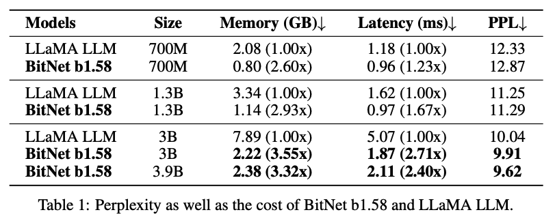

# MLX BitNet


Implementation of the 1.58 Bit LLM from the Microsoft Research paper "The Era of 1-bit LLMs: All Large Language Models are in 1.58 Bits" on Apple Silicon using MLX.

[Paper link](https://arxiv.org/pdf/2402.17764.pdf)

*Note: MLX is an array framework for machine learning research on Apple silicon. This model implementation uses MLX. [Repo link](https://github.com/ml-explore/mlx)*

## Usage

To get started with MLX BitNet, follow these steps:

1. Install the required dependencies:
   ```
   pip install -r requirements.txt
   ```

2. Download the model weights from Hugging Face and convert them for use with MLX. This process may take some time as it involves downloading large files:
   ```
   python convert.py
   ```

3. Run the interoperability tests to ensure everything is set up correctly:
   ```
   python test_interop.py
   ```

To enable the long-running tests, we need to remove the skip annotations from the test_interop.py file:

1. Locate the tests that are skipped in `test_interop.py`. These will have a decorator annotation like `@unittest.skip` or `@unittest.skipIf`.
2. Remove the skip decorator from the tests you want to enable.
   For example, change:
   ```python
   @unittest.skip("long-running test")
   def test_some_long_running_process(self):
       # test code here
   ```
   To:
   ```python
   def test_some_long_running_process(self):
       # test code here
   ```
3. Save the `test_interop.py` file.
4. Run the tests again to include the previously skipped tests.

*Note: Be aware that enabling and running long-running tests can significantly increase the time required to complete the test suite.*

## Background

### OG 1 Bit BitNet


The [first BitNet paper](https://arxiv.org/pdf/2310.11453.pdf) outlined a model with 1bit weights (1 or 0). The BitNet architecture simply swaps out linear layers with float weights for linear layers with 1bit weights. Model training, however, requires keeping track of 16bit floats and employing **Quantization-Aware Training**. This showed some promising results.

### Taking BitNet to another level: 1.58 Bits

The second paper, and the one this repository is based on, took the original BitNet paper further and introduced ternary weights (-1, 0 or 1), hence 1.58 Bit since:

$$
\log_2(3) \approx 1.58
$$

The results of this paper were astounding, almost feeling too good to be true, with the research team reporting a **Pareto improvement**, i.e. better in every dimension!

Some highlights:



This shows that the perplexity is better than Llama, while being faster and more memory efficient!

## Acknowledgements

- `1bitLLM` on huggingface for releasing the PyTorch model and model weights that we are using: https://huggingface.co/1bitLLM
- [Nous Research](https://huggingface.co/NousResearch) for [training](https://huggingface.co/NousResearch/OLMo-Bitnet-1B) a 1.58 Bit LLM and independently confirming some preliminary results
- Awni Hannun and all contributors to [MLX](https://github.com/ml-explore/mlx)

## Roadmap

- ✅ **Completed:** 1.58 Bit LLM implementation in MLX
- ✅ **Completed:** Inference in Python
- 🚧 **In Progress:** Optimised kernels for matrix multiplication specifically for 1.58 Bit weights
- 🚧 **In Progress:** Python training
- 🚧 **In Progress:** Inference in Swift for iPhone/iPad
- ⬜ **Not Started:** Demo app showcasing pareto improvement, especially on iPhone
- ⬜ **Not Started:** Fine-tuning in Swift for iPhone/iPad
- ⬜ **Not Started:** Efficient storage format for 1.58 Bit Weights
